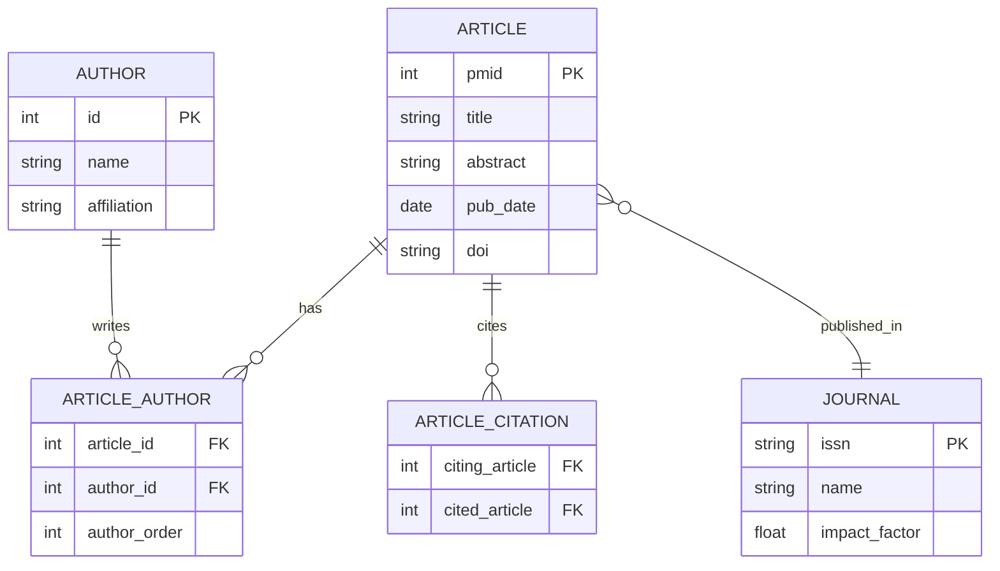

# Database Principles [](https://www.sustech.edu.cn/) []() [](https://adoptium.net/) []() []() []()

> **CS307 Database Principles - Full-Stack Course Project**
>
> A PubMed literature search system with full-stack Java + Vue.js implementation, featuring complex database design, data import pipeline, and interactive frontend.

---

## Overview

This project implements a **full-stack PubMed literature search system** as the capstone of CS307 Database Principles at SUSTech. Starting from database schema design and E-R modeling, we progressively built a PostgreSQL-compatible database with data import pipelines (processing millions of scientific articles) and a Spring Boot + Vue.js web application for real-time literature search and management.

### Key Technical Highlights

- **Database Design**: Complete E-R model with pubmed articles, authors, journals, and citation relationships
- **Data Import Pipeline**: Custom `GoodLoader` bulk import tool with truncate-and-refresh, user management, and PL/pgSQL script execution
- **RESTful API**: Spring Boot backend with layered architecture (Controller -> Service -> Repository)
- **Interactive Frontend**: Vue 3 + Vite SPA with Axios-driven data fetching
- **Multi-language Support**: Python (data preprocessing), Java (core + backend), Vue.js (frontend)

---

## System Architecture

```
┌─────────────────────────────────────────────────────────────────────┐
│                        Frontend (Vue 3 + Vite)                      │
│  ┌─────────────┐  ┌──────────────┐  ┌──────────────────────────┐  │
│  │ Search UI   │  │ Article List │  │ Author / Journal Detail  │  │
│  └──────┬──────┘  └──────┬───────┘  └────────────┬─────────────┘  │
└─────────┼────────────────┼───────────────────────┼─────────────────┘
          │                │                       │
          ▼                ▼                       ▼
┌─────────────────────────────────────────────────────────────────────┐
│                    Backend (Spring Boot + JDBC)                     │
│  ┌─────────────────────────────────────────────────────────────┐   │
│  │ REST API Layer                                              │   │
│  │  GET /api/articles/search       - Full-text search          │   │
│  │  GET /api/articles/{id}         - Article detail            │   │
│  │  GET /api/authors/{name}        - Author info               │   │
│  │  GET /api/journals/{issn}       - Journal detail            │   │
│  │  GET /api/citations/{articleId} - Citation graph            │   │
│  └─────────────────────────────────────────────────────────────┘   │
│  ┌──────────────────────┐   ┌─────────────────────────────────┐   │
│  │ Service Layer        │   │ Repository Layer (JDBC)         │   │
│  └──────────────────────┘   └─────────────────────────────────┘   │
└─────────────────────────────────┬───────────────────────────────────┘
                                  │
                                  ▼
┌─────────────────────────────────────────────────────────────────────┐
│                     Database (PostgreSQL 16)                        │
│  ┌──────────┐  ┌──────────┐  ┌──────────┐  ┌──────────────────┐   │
│  │articles  │  │authors   │  │journals  │  │article_citations │   │
│  └──────────┘  └──────────┘  └──────────┘  └──────────────────┘   │
│  ┌─────────────────────────────────────────────────────────────┐   │
│  │ PL/pgSQL Functions / Triggers / Indexes                    │   │
│  └─────────────────────────────────────────────────────────────┘   │
└─────────────────────────────────────────────────────────────────────┘
```

### Data Import Pipeline

```
┌─────────────────┐     ┌─────────────────┐     ┌─────────────────┐
│  Raw Data Files │ --> │ Python Parser   │ --> │ Transformed     │
│  (.ndjson)      │     │ (preprocessing) │     │ .csv / .sql     │
└─────────────────┘     └─────────────────┘     └─────────────────┘
                                                        │
                                                        ▼
┌─────────────────┐     ┌─────────────────┐     ┌─────────────────┐
│  PostgreSQL     │ <-- │ GoodLoader.java │ <-- │ SQL Scripts     │
│  Database       │     │ (bulk import)   │     │ (schema + data) │
└─────────────────┘     └─────────────────┘     └─────────────────┘
```

---

## Database Design

### Entity-Relationship Model



### Schema Highlights

| Table | Purpose | Key Constraints |
|-------|---------|-----------------|
| `articles` | Core pubmed articles | PK `pmid`, full-text index on `title`/`abstract` |
| `authors` | Author information | Unique `name` + `affiliation` |
| `journals` | Journal metadata | PK `issn`, unique `name` |
| `article_authors` | Many-to-many relationship | Composite PK `(article_id, author_id)` |
| `article_citations` | Citation graph | Foreign keys referencing `articles.pmid` |

---

## Project 1: Database Foundation

### Tasks & Implementation

| Task | Description | Technology |
|------|-------------|------------|
| **Schema Design** | Create complete database schema with constraints | SQL (DDL) |
| **Data Import** | Import pubmed data with validation | Java + JDBC |
| **Data Cleaning** | Truncate, reset, and manage data lifecycle | PL/pgSQL |
| **User Management** | Create roles with appropriate permissions | PL/pgSQL |
| **SQL Queries** | Complex queries with JOINs, aggregations, subqueries | SQL |

### Directory Structure

```
project1/
├── files/                          # Data files and resources
├── src_java/                       # Java source code
│   ├── DatabaseCleaner.java        # Database truncate/reset utility
│   ├── DataInserter.java           # Batch data insertion
│   └── ...                         # Other utilities
├── src_python/                     # Python preprocessing scripts
│   └── data_parser.py              # NDJSON -> CSV transformer
├── src_sql/                        # SQL scripts
│   ├── schema_create.sql           # DDL statements
│   ├── schema_drop.sql             # Cleanup script
│   ├── queries.sql                 # Sample queries
│   └── user_management.sql         # Role/permission scripts
├── Fall 2024 CS307 Project Part I.pdf   # Course requirements
├── Report_12311004_12311043.pdf         # Project report
└── database_project_final.zip           # Submission package
```

---

## Project 2: Full-Stack Application

### Architecture Components

#### Backend (Spring Boot)

| Layer | Package | Responsibility |
|-------|---------|----------------|
| **Controller** | `com.cs307.controller` | REST endpoints, request validation |
| **Service** | `com.cs307.service` | Business logic, data transformation |
| **Repository** | `com.cs307.repository` | Database access via JDBC |
| **Model** | `com.cs307.model` | Entity classes (Article, Author, Journal) |
| **Config** | `com.cs307.config` | Database connection, CORS settings |

#### Frontend (Vue 3)

| Component | Purpose |
|-----------|---------|
| **SearchView** | Main search interface with filters |
| **ArticleList** | Paginated article display with sorting |
| **ArticleDetail** | Single article view with citation info |
| **AuthorView** | Author profile with publication list |
| **JournalView** | Journal details and published articles |
| **CitationGraph** | Interactive citation relationship visualization |

### API Endpoints

| Method | Endpoint | Description |
|--------|----------|-------------|
| `GET` | `/api/articles/search?q={query}&page={n}` | Full-text search with pagination |
| `GET` | `/api/articles/{pmid}` | Get article detail by PMID |
| `GET` | `/api/articles/{pmid}/authors` | Get authors of an article |
| `GET` | `/api/articles/{pmid}/citations` | Get citation references |
| `GET` | `/api/authors/{name}` | Get author info and publications |
| `GET` | `/api/journals/{issn}` | Get journal details |
| `GET` | `/api/journals/{issn}/articles` | Get articles published in journal |
| `GET` | `/api/stats/overview` | Database statistics Overview |

### Directory Structure

```
project2/
├── Project2_code（backend_to_frontend）/    # Spring Boot backend
│   ├── src/main/java/com/cs307/
│   │   ├── Application.java                # Entry point
│   │   ├── controller/                     # REST controllers
│   │   ├── service/                        # Business logic
│   │   ├── repository/                     # Data access layer
│   │   ├── model/                          # Entity classes
│   │   └── config/                         # Configuration
│   └── src/main/resources/
│       └── application.yml                 # App configuration
├── my-vue-app（frontend）/                  # Vue 3 frontend
│   ├── src/
│   │   ├── views/                          # Page components
│   │   ├── components/                     # Reusable components
│   │   ├── router/                         # Vue Router config
│   │   ├── services/                       # API service layer
│   │   └── store/                          # State management
│   ├── public/                             # Static assets
│   ├── package.json                        # Dependencies
│   └── vite.config.js                      # Build config
├── pubmed-main/                            # PubMed data processing
├── submit/                                 # Submission files
│   └── GoodLoader.java                     # Standard data import script
├── Datagrip_diagram.png                    # Database diagram

-E-R绘制的数据库设计图
├── report_12311004_12311043.pdf             # Project report
└── README.md                               # Project2 documentation
```

---

## Data Flow

```
User ──> Vue Frontend ──> REST API ──> Spring Boot ──> PostgreSQL
  ^                              │                         │
  │                              │                         │
  └────── JSON Response ◄────────┘◄────── Query Result ◘──┘

Import Flow:
pubmed24n.ndjson ──> Python Parser ──> CSV Files ──> GoodLoader.java ──> PostgreSQL
```

---

## Results

- [x] Complete E-R model with 5 entities and 4 relationships
- [x] Schema creation with proper constraints, indexes, and triggers
- [x] GoodLoader successfully imports millions of article records
- [x] PL/pgSQL scripts for database management (truncate, user roles)
- [x] Spring Boot backend with 8+ REST endpoints
- [x] Vue 3 frontend with search, detail, and browsing features
- [x] Full CRUD operations visible through web interface
- [x] Multi-table JOIN queries optimized with indexes

---

## Getting Started

### Prerequisites

| Tool | Version | Purpose |
|------|---------|---------|
| **Java** | 17+ | Backend runtime |
| **PostgreSQL** | 16 | Database server |
| **Gradle** | 8.3+ | Java build tool |
| **Node.js** | 18+ | Frontend runtime |
| **Python** | 3.8+ | Data preprocessing |

### Setup Steps

```bash
# 1. Clone repository
git clone https://github.com/csgrace/Database_principle.git
cd Database_principle

# 2. Set up PostgreSQL database
psql -U postgres -f project1/src_sql/schema_create.sql

# 3. Import data using GoodLoader
cd project2/submit
javac GoodLoader.java
java GoodLoader --input ../pubmed-main/data.ndjson --schema cs307

# 4. Start Spring Boot backend
cd ../Project2_code（backend_to_frontend）
./gradlew bootRun

# 5. Start Vue frontend
cd ../my-vue-app（frontend）
npm install
npm run dev

# 6. Access application
# Frontend: http://localhost:5173
# Backend API: http://localhost:8080
```

---

## Highlights

| Feature | Description |
|---------|-------------|
| **Custom Data Loader** | `GoodLoader` with batch insertion, truncate-refresh, schema isolation |
| **Full-Text Search** | PostgreSQL tsvector-powered search across article titles and abstracts |
| **Citation Graph** | Recursive CTE queries for citation chain traversal |
| **Layered Architecture** | Clean separation: Controller -> Service -> Repository |
| **Responsive UI** | Vue 3 Composition API with real-time search and pagination |
| **Multi-language Stack** | Python (etl) + Java (backend) + Vue.js (frontend) |
| **Automated Import** | Single-command data pipeline from raw NDJSON to queryable database |

---

## Tech Stack Summary

| Layer | Technology | Version |
|-------|------------|---------|
| **Database** | PostgreSQL | 16 |
| **Backend** | Spring Boot + JDBC + Gradle | 2.7 / 8.3 |
| **Frontend** | Vue 3 + Vite + Axios | Latest |
| **Data Processing** | Python (pandas, json) | 3.8+ |
| **Build Tool** | Gradle / npm | - |
| **Version Control** | Git + GitHub | - |
